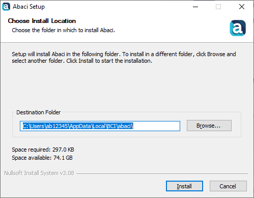

## Prerequisites

The following software is required to use abaci:

1. Abaqus
2. Intel Fortran Compiler

```{note}
To use abaci, Abaqus and the Intel Fortran compiler need to be available within
your command line environment.

- On Windows you can use the 'Abaqus Command + iFort' link from the start menu
- On Linux, you can add the appropriate environment module or source the setvars
script from your Intel compiler installation.
```

### Check Environment

You can check that all prerequisites are available by running the following
commands in your terminal:

```shell
  abaqus information=version
  ifort --version
```

which should output information about the current Abaqus and Intel Fortran compiler versions.
If either of these commands fails, then you should first check your environment is setup correctly.


## Option 1 (Recommended): Installers

Self-contained installers are available to download for Windows and Linux from the [latest release page](https://github.com/BristolCompositesInstitute/abaci/releases/latest).

```{hint}
You __do not need to be an administrator__ to use the Abaci installers, since they will install for the local user only.
```

### Windows

Simply download the `abaci-installer.exe` executable from the [latest release page](https://github.com/BristolCompositesInstitute/abaci/releases/latest)
and run the installer.

- It is recommended to leave the default destination folder unchanged



### On Linux

Download the `abaci-installer.sh` script from the [latest release page](https://github.com/BristolCompositesInstitute/abaci/releases/latest)
and then enable execution with:

```shell
  chmod u+x abaci-installer.sh
```

Then execute with:

```shell
  ./abaci-installer.sh
```

The Linux installer will install abaci to `$HOME/.local/bin`, so you should ensure that this folder is on your path if not already;
you can do this by adding the following line to the end of your `$HOME/.bash_profile` file:

```shell
export PATH=$PATH:$HOME/.local/bin
```


## Option 2: Clone the Repository

First clone the repository with git:

```shell
  git clone git@github.com:BristolCompositesInstitute/abaci.git
```

Then run one of the installation scripts in the `scripts` subfolder:

- `./scripts/install` on Linux
- `./scripts/install-windows.cmd` on Windows

The Linux installer will install abaci to `$HOME/.local/bin`, so you should ensure that this folder is on your path if not already.


## Check Your Installation

After following the installations instruction above, you can verify your abaci installation
by opening a command window and running:

```shell
  abaci --version
```

which should output version information for abaci.


## Install Locations

The self-contained Windows installer will install Abaci files to
`c:\Users\<username>\AppData\BCI\abaci` by default.

The Windows installer script (`install-windows.cmd`) and will place
the launcher script in `c:\SIMULIA\Commands` (with the abaqus launcher).

The Linux installer script will install Abaci files to `$HOME/.local/lib/abaci` and will place
the launcher script in `$HOME/.local/bin`.